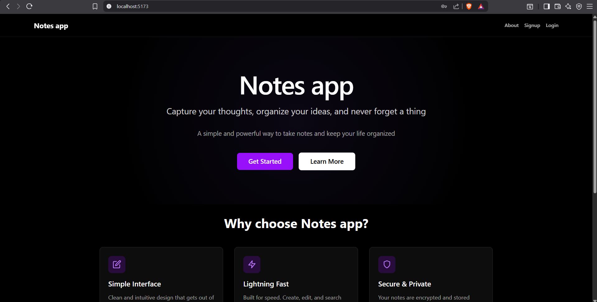
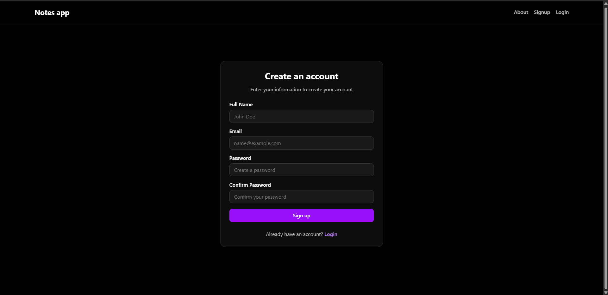
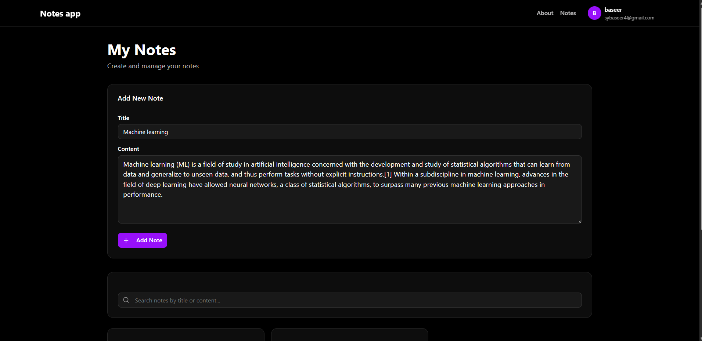
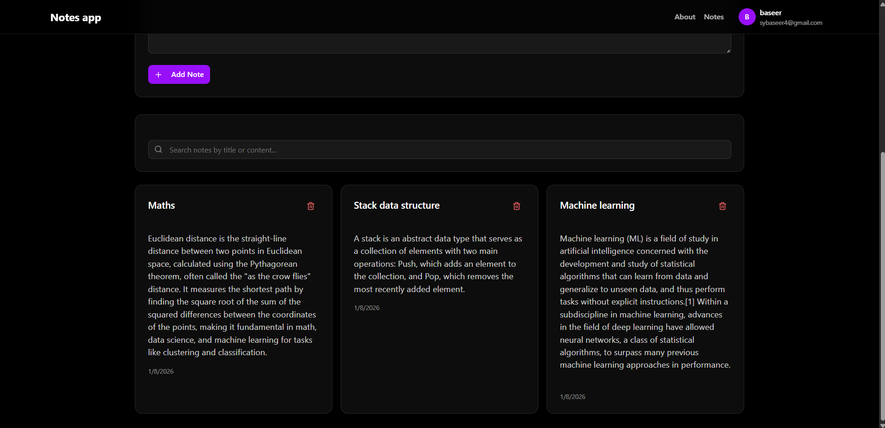
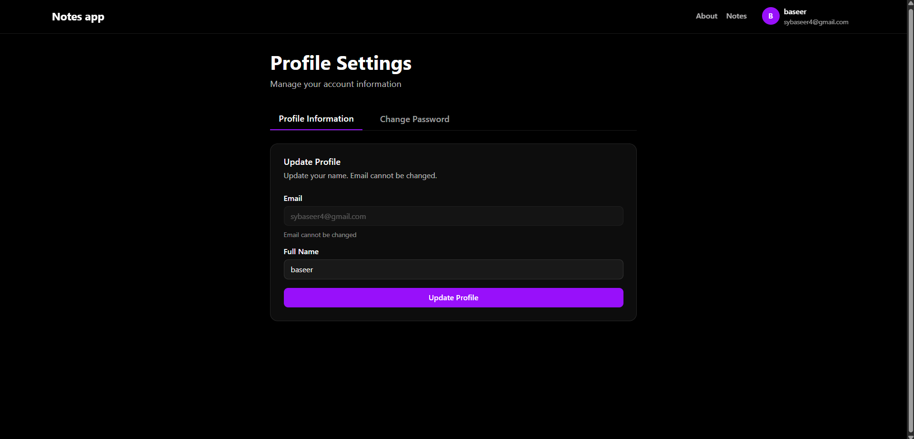

# Notes Application

A full-stack web application featuring user authentication, profile management, and CRUD operations for notes. Built with React, Node.js, Express, and MongoDB.

<p align="center">
  
  
  
</p>

<p align="center">
  
  
</p>

## Features

### Authentication
- User registration with email and password
- User login with JWT-based authentication
- Secure password hashing using bcrypt
- Protected routes requiring authentication
- Session management with HTTP-only cookies

### User Profile
- View user profile information
- Update user profile (name only, email is locked)
- Change password with current password verification
- Profile displayed in navbar with dropdown menu

### Notes Management
- Create new notes with title and content
- View all notes in a responsive grid layout
- Delete notes with confirmation
- Search notes by title or content in real-time
- Notes are user-specific and private

### UI/UX
- Responsive design using TailwindCSS
- Modern dark theme interface
- Form validation on client and server side
- Error handling and user feedback
- Loading states for async operations

## Tech Stack

### Frontend
- React 19.2.0
- React Router DOM 7.11.0
- Zustand for state management
- Axios for API calls
- TailwindCSS 4.1.18 & Shadcn ui for styling
- Vite as build tool

### Backend
- Node.js
- Express 5.2.1
- MongoDB with Mongoose 9.1.2
- JWT for authentication
- bcryptjs for password hashing
- CORS for cross-origin requests
- Cookie-parser for cookie handling

## Project Structure

```
judix-assignment/
├── backend/
│   ├── src/
│   │   ├── controllers/
│   │   │   ├── notes.controller.js
│   │   │   └── users.controller.js
│   │   ├── middleware/
│   │   │   └── auth.middleware.js
│   │   ├── models/
│   │   │   ├── notes.model.js
│   │   │   └── users.model.js
│   │   ├── routes/
│   │   │   ├── auth.route.js
│   │   │   └── notes.route.js
│   │   ├── lib/
│   │   │   ├── db.js
│   │   │   └── utils.js
│   │   └── index.js
│   └── package.json
├── frontend/
│   ├── src/
│   │   ├── components/
│   │   │   ├── ui/
│   │   │   ├── LayoutWithNavbar.jsx
│   │   │   └── ProtectedRoute.jsx
│   │   ├── pages/
│   │   │   ├── HomePage.jsx
│   │   │   ├── LoginPage.jsx
│   │   │   ├── SignUpPage.jsx
│   │   │   ├── NotesPage.jsx
│   │   │   ├── ProfilePage.jsx
│   │   │   ├── AboutPage.jsx
│   │   │   └── PageNotFound.jsx
│   │   ├── store/
│   │   │   ├── useAuthStore.jsx
│   │   │   └── useNotesStore.jsx
│   │   ├── lib/
│   │   │   ├── axios.js
│   │   │   └── utils.js
│   │   ├── App.jsx
│   │   └── main.jsx
│   └── package.json
└── README.md
```

## Setup Instructions

### Prerequisites
- Node.js (v18 or higher)
- MongoDB database (local or cloud instance like MongoDB Atlas)
- npm or yarn package manager

### Backend Setup

1. Navigate to the backend directory:
```bash
cd backend
```

2. Install dependencies:
```bash
npm install
```

3. Create a `.env` file in the backend directory with the following variables:
```
PORT=8000
MONGODB_URI=your_mongodb_connection_string
JWT_SECRET=your_jwt_secret_key
VITE_FRONTEND_URL=http://localhost:5173
```

4. Start the development server:
```bash
npm run dev
```

The backend server will run on `http://localhost:8000`

### Frontend Setup

1. Navigate to the frontend directory:
```bash
cd frontend
```

2. Install dependencies:
```bash
npm install
```

3. Create a `.env` file in the frontend directory (optional, defaults are set):
```
VITE_API_URL=http://localhost:8000/api/
```

4. Start the development server:
```bash
npm run dev
```

The frontend will run on `http://localhost:5173`

## API Documentation

### Authentication Endpoints

#### POST /api/auth/signup
Register a new user.

Request Body:
```json
{
  "fullName": "John Doe",
  "email": "john@example.com",
  "password": "password123"
}
```

#### POST /api/auth/login
Login with email and password.

Request Body:
```json
{
  "email": "john@example.com",
  "password": "password123"
}
```

#### POST /api/auth/logout
Logout the current user.

Response:
```json
{
  "message": "Logged out successfully"
}
```

#### GET /api/auth/check
Check if user is authenticated (requires authentication).

Response:
```json
{
  "_id": "user_id",
  "fullName": "John Doe",
  "email": "john@example.com"
}
```

#### PUT /api/auth/profile
Update user profile (requires authentication).

Request Body:
```json
{
  "fullName": "John Updated"
}
```

Response:
```json
{
  "_id": "user_id",
  "fullName": "John Updated",
  "email": "john@example.com"
}
```

#### PUT /api/auth/password
Change user password (requires authentication).

Request Body:
```json
{
  "currentPassword": "oldpassword123",
  "newPassword": "newpassword123"
}
```

Response:
```json
{
  "message": "Password updated successfully"
}
```

### Notes Endpoints

#### GET /api/notes
Get all notes for the authenticated user (requires authentication).

Response:
```json
[
  {
    "_id": "note_id",
    "title": "Note Title",
    "content": "Note content",
    "userId": "user_id",
    "createdAt": "2024-01-01T00:00:00.000Z",
    "updatedAt": "2024-01-01T00:00:00.000Z"
  }
]
```

#### POST /api/notes
Create a new note (requires authentication).

Request Body:
```json
{
  "title": "Note Title",
  "content": "Note content"
}
```

Response:
```json
{
  "_id": "note_id",
  "title": "Note Title",
  "content": "Note content",
  "userId": "user_id",
  "createdAt": "2024-01-01T00:00:00.000Z",
  "updatedAt": "2024-01-01T00:00:00.000Z"
}
```

#### DELETE /api/notes/:id
Delete a note by ID (requires authentication).

Response:
```json
{
  "message": "Note deleted successfully"
}
```

## Authentication

The application uses JWT (JSON Web Tokens) for authentication. Tokens are stored in HTTP-only cookies for security. All protected routes require a valid JWT token in the request cookies.

### Protected Routes
- GET /api/auth/check
- PUT /api/auth/profile
- PUT /api/auth/password
- GET /api/notes
- POST /api/notes
- DELETE /api/notes/:id

## Security Features

- Password hashing using bcrypt with salt rounds
- JWT tokens stored in HTTP-only cookies
- CORS configuration for secure cross-origin requests
- Input validation on both client and server side
- Protected routes with authentication middleware
- User-specific data isolation (users can only access their own notes)

## Scaling Considerations for Production

### Backend Scaling

1. **Database Optimization**
   - Implement database indexing on frequently queried fields (userId, email)
   - Use connection pooling for MongoDB connections
   - Consider read replicas for high read traffic
   - Implement database sharding for horizontal scaling

2. **Caching Strategy**
   - Implement Redis for session management and caching
   - Cache frequently accessed user data
   - Cache note lists with TTL (Time To Live) for better performance

3. **API Optimization**
   - Implement pagination for notes list endpoint
   - Add rate limiting to prevent abuse
   - Use compression middleware (gzip) for responses
   - Implement request validation middleware

4. **Security Enhancements**
   - Implement rate limiting per IP/user
   - Add request size limits
   - Use helmet.js for security headers
   - Implement CSRF protection
   - Regular security audits and dependency updates

5. **Deployment**
   - Use process manager (PM2) for Node.js applications
   - Implement load balancing with multiple server instances
   - Use reverse proxy (Nginx) for static assets and load distribution
   - Set up environment-specific configurations

### Frontend Scaling

1. **Performance Optimization**
   - Implement code splitting and lazy loading for routes
   - Optimize bundle size with tree shaking
   - Use CDN for static assets
   - Implement service workers for offline functionality
   - Optimize images and assets

2. **State Management**
   - Consider implementing React Query or SWR for server state
   - Implement optimistic updates for better UX
   - Add request deduplication
   - Implement proper error boundaries

3. **Caching and Storage**
   - Implement browser caching strategies
   - Use localStorage for non-sensitive data
   - Implement proper cache invalidation

4. **Build and Deployment**
   - Optimize production builds with minification
   - Implement CI/CD pipeline
   - Use environment variables for different environments
   - Set up automated testing

### Infrastructure Scaling

1. **Containerization**
   - Dockerize both frontend and backend
   - Use Docker Compose for local development
   - Consider Kubernetes for orchestration in production

2. **Cloud Services**
   - Use cloud database services (MongoDB Atlas, AWS DocumentDB)
   - Implement cloud storage for file uploads (AWS S3, Cloudinary)
   - Use CDN for static assets (Cloudflare, AWS CloudFront)
   - Consider serverless functions for specific operations

3. **Monitoring and Analytics**
   - Implement application performance monitoring (APM)
   - Set up real-time error tracking
   - Monitor database performance
   - Track user analytics and behavior

4. **Backup and Recovery**
   - Implement automated database backups
   - Set up disaster recovery procedures
   - Regular backup testing and validation

### API Design for Scale

1. **Versioning**
   - Implement API versioning (/api/v1/, /api/v2/)
   - Maintain backward compatibility
   - Document deprecation policies

2. **Documentation**
   - Maintain up-to-date API documentation
   - Use OpenAPI/Swagger for API specification
   - Provide SDKs for common languages

3. **Testing**
   - Implement unit tests for controllers and utilities
   - Add integration tests for API endpoints
   - Set up end-to-end testing
   - Implement load testing

## Environment Variables

### Backend (.env)
```
PORT=8000
MONGODB_URI=mongodb://localhost:27017/notesapp
JWT_SECRET=your_super_secret_jwt_key_here
VITE_FRONTEND_URL=http://localhost:5173
```

### Frontend (.env)
```
VITE_API_URL=http://localhost:8000/api/
```

## Development

### Running in Development Mode

Backend:
```bash
cd backend
npm run dev
```

Frontend:
```bash
cd frontend
npm run dev
```


## Project

Developed as part of a scalable web application assignment.

